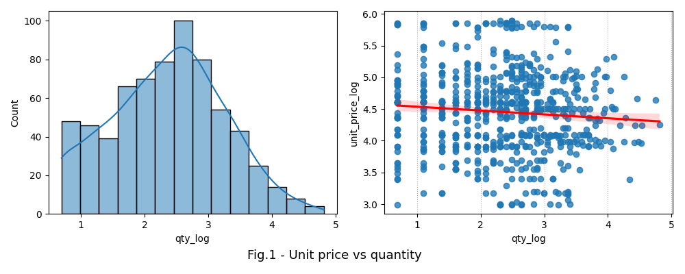
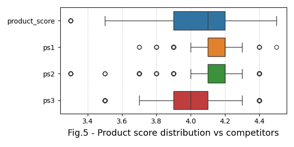
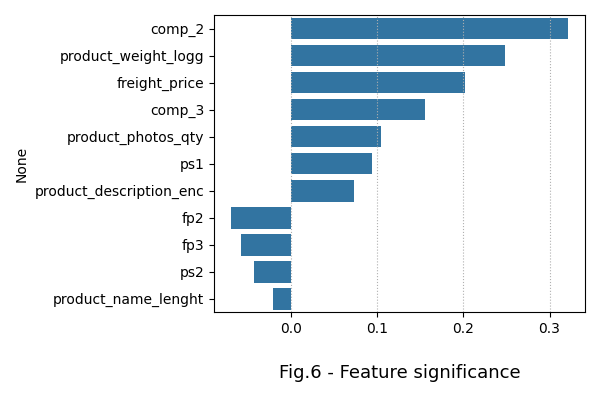

# Retail_pricing


## Content

* [Summary](README.md#Summary)  
* [Project description](README.md#Project-description)  
* [Data and methods](README.md#Data-and-methods)
* [ML model](README.md#ML-model)
* [Proposed algorythm](README.md#Proposed-algorythm)      
* [Project structure](README.md#Project-structure)                   


---

## Summary

It was defined a new pricing model for e-commerce company which is based on machine learning algorythm. It was found factors, influencing the unit price of the good, and proposed actions for optimization of the model 
  

## Project description

An online retailing company sales varous categories of goods. Its company's revenue as well as market share is decreasing over time because of emerging competitors which supply substitute goods with comparable quality. To tackle the problem, the management decided to take a set of actions. It has started with optimization of goods prices.

The business objective of the assignment is to identify factors, affecting price change, and optimize the pricing model.

## Data and methods

[The dataset](https://www.kaggle.com/datasets/suddharshan/retail-price-optimization) contains monthly sales purchases between 2017 and 2018 years.  

The unit price is the target feature. It is essential, that it is discounted in case of wholesale as shown on the fig.1.

<div align="center">   </div>

The company is competing with 3 other companies as shown on the fig.2. The company's price range is higher in contrast to that of its competitors. The freight cost distribution of the company goods, however, is wider comparing to that of competitors. It means that the company's stock is located further form its clients than that of competitors. 

<div align="center">   </div>

Sales of goods categories significantly change by month as shown on the fig.4

<div align="center">   </div>

Wide range of product scoring indicates that clients have polar opinions towards company goods as shown on the fig.5

<div align="center">   </div>


## ML model

Although the gradient boosting shows better result, plain regression model with L1 regularization better represents feature significance of the unit price. From the fig.6. it can be inferred:
* the most significant factor is the unit price of the competitor 2. That of competitor 3 is almost twice less important.
* product weight and the freight price are related in some respect. Hence it could be recommended to spread the company stock closer to customers. The lower the freight price of competitors, the higher the unit's price.
* quality of photos and length of product description positively affect the unit price
* product scoring of the competitor 1 positively correlates with the price of company goods whereas that of competitior 2 and 3 negatively correlate with the price. It could mean that company goods are similar to that of competitors 2 and 3, but differs from that of the cometitor 1. It could be recommended to study drivers of user ratings.

<div align="center">   </div>
 

 

## Project structure

<details>
  <summary>display project structure </summary>

```Python
Loan_repayment
├── .gitignore
├── config
│   └── config.json     # configuration settings
├── data                # data archive
│   └── retail_price.zip
├── figures             # project figures and charts
│   ├── fig_1.png
.....
│   └── fig_xx.png

├── notebooks           # notebooks
│   └── Retail_pricing.ipynb
├── README.md
├── requirements.txt    
└── utils               # functions and data loaders
    ├── config_reader.py
    ├── figures.py
    └── models_utils.py
 
```
</details>
